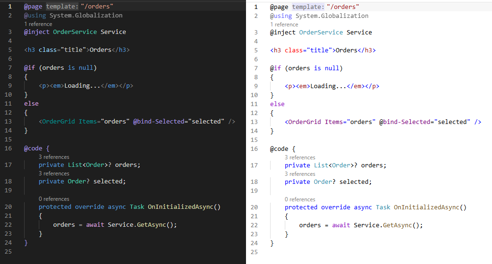
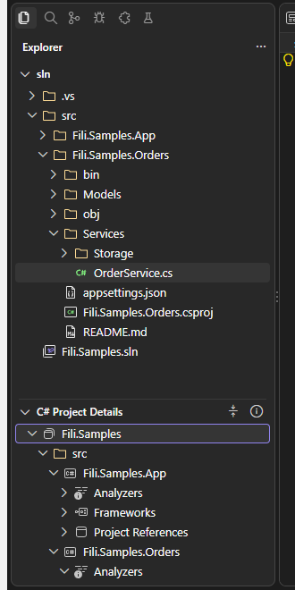
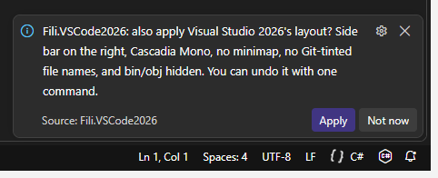

# Fili - VSCode2026 Extension

[](https://marketplace.visualstudio.com/items?itemName=FiliArrochada.fili-vscode2026)
[](https://marketplace.visualstudio.com/items?itemName=FiliArrochada.fili-vscode2026)
[](https://marketplace.visualstudio.com/items?itemName=FiliArrochada.fili-vscode2026&ssr=false#review-details)
[](https://open-vsx.org/extension/FiliArrochada/fili-vscode2026)
[](https://github.com/FiliArrochada/Fili.Theme.VSCode2026/actions/workflows/ci.yml)

Visual Studio 2026's Dark and Light themes, rebuilt for VS Code from Visual Studio's own theme files.

The colours aren't eyeballed from screenshots. They were read out of the theme definitions that
ship with Visual Studio 2026 (18.x), the same Fluent tokens the IDE draws itself with. Each value
was then checked against pixels sampled from a running Visual Studio 2026 window. Every colour in
the source records which Visual Studio token it came from.

## Fili.VSCode2026 Dark

Visual Studio 2026-inspired Fluent dark appearance for VS Code.


## Fili.VSCode2026 Light

Visual Studio 2026-inspired Fluent light appearance for VS Code.


## Every Visual Studio 2026 theme

Besides Dark and Light, the extension carries every other theme Visual Studio 2026 ships:

| Built on Dark | Built on Light |
|---|---|
| Fili.VSCode2026 Dark (Cool Slate) | Fili.VSCode2026 Light (Bubblegum) |
| Fili.VSCode2026 Dark (Juicy Plum) | Fili.VSCode2026 Light (Cool Breeze) |
| Fili.VSCode2026 Dark (Moonlight Glow) | Fili.VSCode2026 Light (Icy Mint) |
| Fili.VSCode2026 Dark (Mystical Forest) | Fili.VSCode2026 Light (Mango Paradise) |
| Fili.VSCode2026 Dark (Spicy Red) | Fili.VSCode2026 Light (Silky Pink) |
| Fili.VSCode2026 Dark (Extra Contrast) | Fili.VSCode2026 Light (Sunny Day) |
| | Fili.VSCode2026 Light (Extra Contrast) |


In Visual Studio these are small deltas on Dark or Light, and they are here too:

- **The tinted themes** recolour the shell. The frame is tinted strongly, the tool windows and
  tabs faintly, and the focused-window outline and Solution Explorer's selection pill take the
  theme's own colour. The editor, the syntax colours and the purple buttons stay as in Dark or
  Light, exactly as Visual Studio keeps them.
- **The Extra Contrast themes** recolour the editor: brighter (Dark) or deeper (Light) syntax,
  line numbers, hints and diff colours. Visual Studio offers them as an *editor appearance* you
  can pair with any colour theme. VS Code has no such split, so each one here is its base theme's
  shell with the Extra Contrast editor.

Each variant's colours were generated from that theme's own Visual Studio tokens, with the same
rules that reproduce Dark and Light, and checked against a live Visual Studio 2026 window.
High Contrast is not included, because Visual Studio's version takes its colours from Windows'
contrast settings at run time, and VS Code already switches to its own high-contrast theme when
Windows' contrast mode is on.

## Installation

Open **Extensions** (`Ctrl+Shift+X`), search for **Fili.VSCode2026**, and choose **Install**. Or
from a terminal:

```text
code --install-extension FiliArrochada.fili-vscode2026
```

It is published to both the [Visual Studio Marketplace](https://marketplace.visualstudio.com/items?itemName=FiliArrochada.fili-vscode2026)
and [Open VSX](https://open-vsx.org/extension/FiliArrochada/fili-vscode2026), so the same search
finds it in VSCodium, Cursor, Windsurf, Gitpod and other editors that use Open VSX.

Every version's `.vsix` is also attached to its [GitHub release](https://github.com/FiliArrochada/Fili.Theme.VSCode2026/releases).
To install one, choose **…** › **Install from VSIX…** in the Extensions view, or run
`code --install-extension fili-vscode2026-<version>.vsix`.

Then select a theme:

```text
Ctrl+K Ctrl+T
```

and choose either:

```text
Fili.VSCode2026 Dark
```

or:

```text
Fili.VSCode2026 Light
```

or any of the variants above.

Installing the extension also gives VS Code Visual Studio's look, with no setup:

- **Fili.VSCode2026 Icons** becomes the default file icon theme: Solution Explorer's outline icons.
- **Fili.VSCode2026 Fluent Icons** becomes the default product icon theme: toolbar, activity bar,
  debugger and tree icons from Microsoft's Fluent System Icons, the icon family Visual Studio 2026
  is drawn with, in place of VS Code's codicons.
- The tree gets a 12px indent, no indent guides and no compacted folders.
- The activity bar moves to the top of the side bar as a small row of icons, since Visual Studio
  has none; moved back to the side, it stays compact.

These are defaults, not changes to your settings: anything you have set yourself still wins, and
uninstalling the extension puts VS Code's own defaults back. To use other icons, pick them with
**Preferences: File Icon Theme** or **Preferences: Product Icon Theme** as usual.

### Recommended companions

For the rest of the Visual Studio experience, these Microsoft extensions pair well with the theme:

| Extension | What it adds |
|---|---|
| [C#](https://marketplace.visualstudio.com/items?itemName=ms-dotnettools.csharp) | C# support. Its Roslyn language server supplies the semantic information (class versus interface, local versus field) that the theme's C# colours key on; without it, VS Code falls back to a grammar that cannot tell an interface from a class |
| [C# Dev Kit](https://marketplace.visualstudio.com/items?itemName=ms-dotnettools.csdevkit) | A solution view, the **C# Project Details** view in the Explorer, with the solution, its projects and their dependencies, as Solution Explorer shows them. Free for individuals; organisations use it under a Visual Studio subscription |
| [Visual Studio Keymap](https://marketplace.visualstudio.com/items?itemName=ms-vscode.vs-keybindings) | Visual Studio's keyboard shortcuts (F12, Ctrl+K Ctrl+C, F5, F10, F11, ...) |

```text
code --install-extension ms-dotnettools.csharp --install-extension ms-dotnettools.csdevkit --install-extension ms-vscode.vs-keybindings
```

## What makes it Visual Studio 2026 and not Dark+ or Light+

**The accent is Visual Studio purple, not blue.** In VS 2026 the accent (`AccentFillDefault`) is
`#9184EE` in Dark and `#5649B0` in Light. Visual Studio uses it for the focused window outline,
primary buttons, badges and progress. Blue is kept for what Visual Studio makes blue: text
selection, hyperlinks and informational states. The status bar is a dark neutral strip, not VS
Code's bright blue, and turns orange-red while debugging, as Visual Studio's does.

**The surfaces are layered like Visual Studio's.** The frame is the darkest (Dark) or grayest
(Light) surface. Tool windows and the tab strip sit on it as slightly lifted cards, and the editor
is its own tone:

| Surface | Dark | Light | Visual Studio token |
|---|---|---|---|
| Frame, title bar, menu bar | `#1C1C1C` | `#EEEEEE` | `ShellInternal.EnvironmentBackground` |
| Tool windows, panels, active tab | `#282828` | `#F9F9F9` | `ShellInternal.EnvironmentTab` |
| Tab strip | `#262626` | `#F7F7F7` | sampled |
| Editor | `#1E1E1E` | `#FFFFFF` | Plain Text background |
| Menus, IntelliSense, hovers | `#2C2C2C` | `#F9F9F9` | `Shell.SurfaceBackgroundFillDefault` |
| Window outline | `#454545` | `#ADADAD` | `ShellInternal.EnvironmentBorderInactive` |
| Status bar | `#141414` | `#6C6C6C` | `ShellInternal.StatusBarBackgroundFillRest` |

The Light theme is not an inverted Dark. It is built from Visual Studio 2026 Light's own values: a
white editor on a `#EEEEEE` frame, near-white cards, and a dark-gray status bar with white text,
which is what Visual Studio 2026 Light actually draws.

**C# is coloured by Roslyn classification, as in Visual Studio.**

| Classification | Dark | Light |
|---|---|---|
| Keyword | `#569CD6` | `#0000FF` |
| Control keyword (`if`, `for`, `return`, `await`, `try`) | `#D8A0DF` | `#8F08C4` |
| Class, delegate, record, attribute | `#4EC9B0` | `#2B91AF` |
| Struct, record struct | `#86C691` | `#2B91AF` |
| Interface, enum, type parameter | `#B8D7A3` | `#2B91AF` |
| Method, extension method, overloaded operator | `#DCDCAA` | `#74531F` |
| Local, parameter | `#9CDCFE` | `#1F377F` |
| String / verbatim string | `#D69D85` | `#A31515` / `#800000` |
| Escape sequence | `#FFD68F` | `#B776FB` |
| Number | `#B5CEA8` | `#000000` |
| Comment | `#57A64A` | `#008000` |
| XML doc comment text / tags | `#608B4E` | `#008000` / `#808080` |
| Preprocessor directive | `#9B9B9B` | `#808080` |
| Field, property, event, constant, enum member, namespace | plain text | plain text |

That last row is deliberate. Visual Studio does not colour members or namespaces, so neither does
this theme. Regex strings get Visual Studio's regex colours, and brace pairs cycle through Visual
Studio's three brace-pair colours. Warnings get Visual Studio's **green** squiggle rather than VS
Code's yellow one.

**The web and data languages use Visual Studio's colours too.** Each was sampled from Visual Studio
2026 itself, because its Light theme leaves most of them to built-in defaults:

| Language | What is coloured | Dark | Light |
|---|---|---|---|
| Razor | `@` transitions and directives (`@page`, `@inject`, `@code`) | `#A699E6` | `#000000` |
| | directive attributes (`@bind-Value`, `@onclick`) | `#A699E6` | `#800080` |
| | components and tag helpers, with their attributes | `#009696` | `#800080` |
| SCSS, Less | variables | `#C563BD` | `#800080` |
| | mixins (SCSS) | `#7DBAD7` | `#800000` |
| | `@mixin`, `@include` | `#569CD6` | `#800080` |
| HTML | attribute names (apart from XML's) | `#9CDCFE` | `#FF0000` |
| JSON | property names | `#D7BA7D` | `#2E75B6` |
| SQL | system functions (`COUNT`, `GETDATE`) | `#C975D5` | `#FF00FF` |
| | strings | `#CB4141` | `#FF0000` |

Razor's component colours come from the C# extension's Razor language server, so they appear once
it has loaded the project.



**Every colour says where it came from.** [docs/PARITY.md](docs/PARITY.md) lists all of them, Dark
and Light, with the Visual Studio token, sample or reasoning behind each and what it colours in VS
Code, and counts how many are Visual Studio's own values. It is generated from the palettes, so it
cannot fall out of date.

## Solution Explorer

The Explorer was matched against Visual Studio 2026's Solution Explorer, sampled from a live
window with a two-project solution open:

| | Visual Studio 2026 | Fili.VSCode2026 |
|---|---|---|
| Selected row, focused or not | `#353535` Dark, `#EAEAEA` Light | the same |
| Indent per level | 12px | 12px, set on install |
| Indent guides | none | none, set on install |
| Folders | amber outline, the same when expanded | the same, via **Fili.VSCode2026 Icons** (default on install) |
| C# files | green `C#` glyph | the same |
| `Properties`, `wwwroot` | folder with a wrench, folder with a globe | the same |
| Other files | outline glyphs, one per kind of file | 21 kinds: solution, project, C#, Razor, XAML, MSBuild, resources, JSON, XML, settings, scripts, Markdown, text, images, SQL, HTML, CSS, JavaScript, TypeScript, Docker and Git files, with a plain page for the rest; the web languages carry a colour accent so they stand apart |
| `bin`, `obj`, `.vs` | not shown | hidden with `files.exclude` |

Visual Studio keeps the same fill whether or not Solution Explorer has focus, and so does the
theme. The icons are original drawings in Visual Studio's outline style, not copies of Visual
Studio's own icons.

VS Code's Explorer shows the folders on disk. For the solution itself — its projects and their
*Dependencies*, as Visual Studio shows them — install Microsoft's **C# Dev Kit** (see the recommended
companions above). It adds a solution view to the Explorer, titled **C# Project Details** in current versions,
drawn in the same theme colours:



## Making the layout look like Visual Studio 2026 too

The icons and tree layout are applied automatically (see above). The rest of Visual Studio's
layout changes behaviour as well as looks, so it is one command away instead of forced: run
**Fili.VSCode2026: Apply Visual Studio 2026 Layout** from the Command Palette (`Ctrl+Shift+P`).
The extension also offers it once, in a notification, the first time you use one of its themes:



It sets, in your user settings:

| Setting | Value | Why |
|---|---|---|
| `workbench.sideBar.location` | `right` | Solution Explorer sits on the right in Visual Studio (VS Code then puts its secondary side bar, with Chat, on the left) |
| `editor.fontFamily`, `editor.fontSize` | Cascadia Mono, 13 | Visual Studio's default editor font, at 10pt |
| `terminal.integrated.fontFamily` | Cascadia Mono | the same in the terminal |
| `editor.minimap.enabled` | `false` | Visual Studio shows a scroll bar map instead |
| `editor.renderLineHighlight` | `line` | Visual Studio highlights the current line only |
| `editor.inlayHints.enabled` | `offUnlessPressed` | hints while a key is held, like Alt+F1 in Visual Studio |
| `explorer.decorations.colors`, `workbench.editor.decorations.colors` | `false` | Visual Studio never tints file names by Git status |
| `files.exclude` | adds `bin`, `obj`, `.vs` | Solution Explorer shows project items, not build output (also hides them from search) |
| `window.title` | solution first | Visual Studio puts the solution name first in its title |

**Fili.VSCode2026: Remove Visual Studio 2026 Layout** takes back exactly those settings, keeping
any you have changed since, and your own `files.exclude` entries.

## Known limits

These are limits of what a VS Code colour theme can express, not choices:

- **No outlined windows or tabs.** Visual Studio draws a 1px outline around each tool window and
  around the active tab, and gives the focused one the theme's window colour (purple in Dark and
  Light, the tint colour in the tinted themes). VS Code can only draw a line above the active tab,
  so that line takes the window colour in the focused editor group and is neutral in the others.
- **No selection pill, and square rows.** Solution Explorer draws the selected row as a rounded
  fill inset 3px from each side, with a 2×16px accent pill at its left edge. VS Code lists draw
  full-width square rows and cannot draw the pill, so the fill colour matches but the shape does
  not.
- **Rows are 22px, not 24px.** VS Code has no setting for list row height, and its UI font is a
  little larger than Visual Studio's.
- **The Explorer shows files, not a project model.** VS Code's own Explorer lists the folders on
  disk; C# Dev Kit's **C# Project Details** view (see above) is the place for the solution and
  projects.
- **No bold active tab.** Visual Studio bolds the active tab's title; themes cannot set font weight
  in the workbench.
- **The current debug statement is tinted, not painted.** Visual Studio fills the current statement
  solid yellow and repaints its text black. A theme cannot change the text colour there, so the
  yellow is translucent enough to keep the code readable.
- **`[Obsolete]` types are struck through but lose their colour.** Visual Studio keeps an obsolete
  type's colour and strikes it through. The C# extension reports it as a deprecated *namespace*
  token, so the class or interface information is gone before the theme sees it: the name is
  struck through, as in Visual Studio, but in plain text.
- **Some language colours have no hook in VS Code.** Visual Studio Light draws Razor code on a pale
  yellow block; a theme cannot give tokens a background. VS Code's grammars give Visual Studio's
  other colours nothing to target: XAML markup extensions (`{Binding Path=Name}`) are one string to
  the XML grammar, a Less mixin call looks like a class selector, and SQL system tables
  (`sys.objects`) and stored procedures look like any other name.
- **The UI font.** Visual Studio draws its interface in Segoe UI at 9pt; VS Code's workbench font
  cannot be changed by an extension or a setting.


## Development

Everything in `themes/` and `icons/`, and the product icon theme JSON, is **generated**. Edit the sources in `src/` and rebuild:

```text
src/palettes/dark.json      every colour role, with the Visual Studio token it came from
src/palettes/light.json     the same roles, tuned for Light
src/palettes/derive.mjs     shared: how each role follows from a Visual Studio theme's tokens
src/palettes/variants/      generated: what each tinted or Extra Contrast theme changes
src/workbench.json          shared: VS Code UI colour -> role (no colours in this file)
src/syntax.json             shared: TextMate scopes and semantic tokens -> role (no colours either)
src/icon-theme.json         shared: file names and extensions -> icon template
src/icons/*.svg             icon templates whose colours are {{role}} placeholders
src/product-icons.json      codicon id -> Fluent System Icons name, for the product icon theme
src/vendor/fluent/          Fluent's name -> codepoint map, vendored with the font
scripts/build.mjs           generates themes/, icons/ and the product icon theme, and enforces the rules below
scripts/variants.mjs        regenerates src/palettes/variants/ from a Visual Studio install
extension.js                the Apply / Remove Visual Studio 2026 Layout commands
test/layout.test.cjs        tests those commands against a stand-in for the VS Code API
```

```text
npm run build      regenerate themes/, icons/ and the product icon theme
npm run check      fail if any of them is out of date
npm test           test the layout commands
npm run coverage   list the VS Code colours no theme sets
npm run variants -- "<VS install dir>"   regenerate the variant palettes
```

Everything runs on Node alone, with no `npm install`. The product icons use Microsoft's
[Fluent System Icons](https://github.com/microsoft/fluentui-system-icons) font as published
(`product-icons/FluentSystemIcons-Regular.woff2`); the build points each codicon in the map at its
16px Regular glyph through the font's own name map in `src/vendor/fluent/`. To update Fluent,
replace both files from the same upstream commit and rebuild.

A variant file holds only the roles its Visual Studio theme changes, and the build merges it onto
Dark or Light, so a variant cannot add or drop a role. `variants.mjs` first evaluates every rule
in `derive.mjs` against Visual Studio's own Dark and Light and stops if any rule fails to
reproduce the base palettes, so a wrong rule cannot silently produce wrong variants.

Dark and Light share one semantic design, so the build enforces it. It fails when:

- the two palettes do not define exactly the same roles
- a shared map names a role that does not exist, or a palette role goes unused
- a shared map or an icon template contains a raw colour instead of a role
- an icon the map names has no template, or a template is unused
- a workbench key is not a colour VS Code registers

It also prints a WCAG contrast table for both themes side by side, so drift between the two modes
shows up.

`scripts/vscode-color-ids.json` is a snapshot of every colour id VS Code registers. Refresh it
after a VS Code update with `npm run registry -- "<VS Code resources/app directory>"`.
`scripts/vs-tokens.mjs` prints the colour tokens a Visual Studio install ships, which is how the
palettes were sourced and how to re-check them after a Visual Studio update.

Press `F5` in this folder to open an Extension Development Host with the themes loaded.

## License

MIT. See [LICENSE](LICENSE). The Fluent Icons product icon theme contains glyphs from Microsoft's
Fluent UI System Icons, also MIT-licensed; see [THIRD-PARTY-NOTICES.md](THIRD-PARTY-NOTICES.md).

Visual Studio and Visual Studio Code are trademarks of Microsoft Corporation. This project is not
affiliated with or endorsed by Microsoft.
