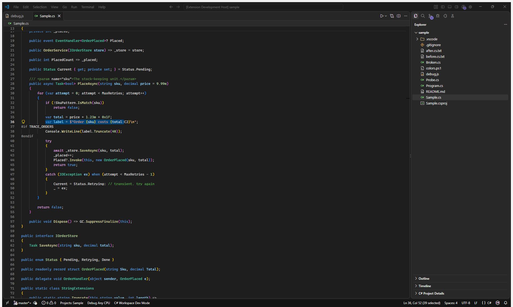
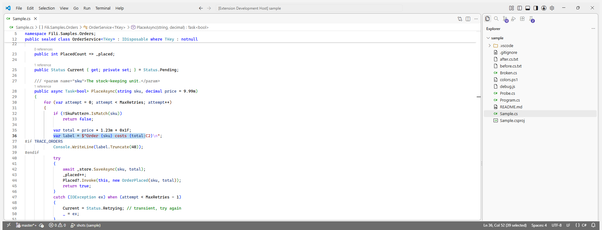
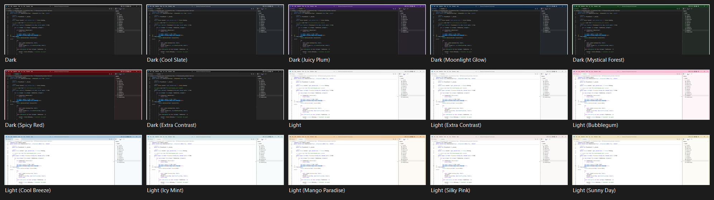
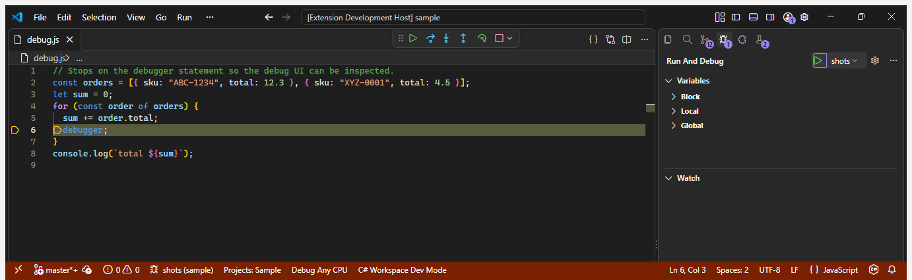
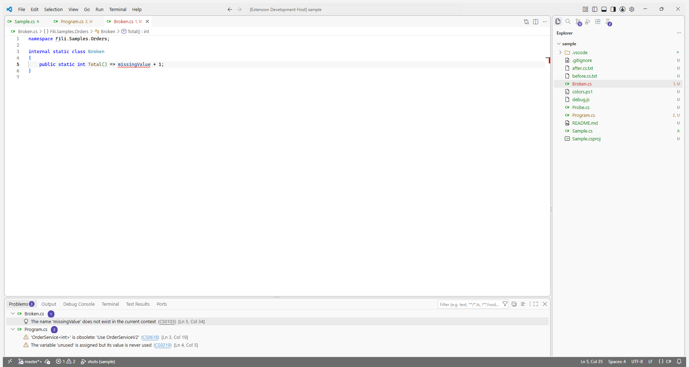

# Fili.VSCode2026

Visual Studio 2026's Dark and Light themes, rebuilt for VS Code from Visual Studio's own theme files.

The colours aren't eyeballed from screenshots. They were read out of the theme definitions that
ship with Visual Studio 2026 (18.x), the same Fluent tokens the IDE draws itself with. Each value
was then checked against pixels sampled from a running Visual Studio 2026 window. Every colour in
the source records which Visual Studio token it came from.

## Fili.VSCode2026 Dark

Visual Studio 2026-inspired Fluent dark appearance for VS Code.



## Fili.VSCode2026 Light

Visual Studio 2026-inspired Fluent light appearance for VS Code.



## Every Visual Studio 2026 theme

Besides Dark and Light, the extension carries every other theme Visual Studio 2026 ships:

| Built on Dark | Built on Light |
|---|---|
| Fili.VSCode2026 Dark (Cool Slate) | Fili.VSCode2026 Light (Bubblegum) |
| Fili.VSCode2026 Dark (Juicy Plum) | Fili.VSCode2026 Light (Cool Breeze) |
| Fili.VSCode2026 Dark (Moonlight Glow) | Fili.VSCode2026 Light (Icy Mint) |
| Fili.VSCode2026 Dark (Mystical Forest) | Fili.VSCode2026 Light (Mango Paradise) |
| Fili.VSCode2026 Dark (Spicy Red) | Fili.VSCode2026 Light (Silky Pink) |
| Fili.VSCode2026 Dark (Extra Contrast) | Fili.VSCode2026 Light (Sunny Day) |
| | Fili.VSCode2026 Light (Extra Contrast) |



In Visual Studio these are small deltas on Dark or Light, and they are here too:

- **The tinted themes** recolour the shell. The frame is tinted strongly, the tool windows and
  tabs faintly, and the focused-window outline and Solution Explorer's selection pill take the
  theme's own colour. The editor, the syntax colours and the purple buttons stay as in Dark or
  Light, exactly as Visual Studio keeps them.
- **The Extra Contrast themes** recolour the editor: brighter (Dark) or deeper (Light) syntax,
  line numbers, hints and diff colours. Visual Studio offers them as an *editor appearance* you
  can pair with any colour theme. VS Code has no such split, so each one here is its base theme's
  shell with the Extra Contrast editor.

Each variant's colours were generated from that theme's own Visual Studio tokens, with the same
rules that reproduce Dark and Light, and checked against a live Visual Studio 2026 window.
High Contrast is not included, because Visual Studio's version takes its colours from Windows'
contrast settings at run time, and VS Code already switches to its own high-contrast theme when
Windows' contrast mode is on.

## Installation

From the Visual Studio Marketplace: open **Extensions** (`Ctrl+Shift+X`), search for
**Fili.VSCode2026**, and choose **Install**. Or from a terminal:

```text
code --install-extension FiliArrochada.fili-vscode2026
```

From a packaged `.vsix`, choose **…** › **Install from VSIX…** in the Extensions view, or:

```text
code --install-extension fili-vscode2026-0.1.0.vsix
```

Then select a theme:

```text
Ctrl+K Ctrl+T
```

and choose either:

```text
Fili.VSCode2026 Dark
```

or:

```text
Fili.VSCode2026 Light
```

or any of the variants above.

Installing the extension also gives the Explorer Solution Explorer's look, with no setup: it
makes **Fili.VSCode2026 Icons** the default file icon theme, and sets a 12px tree indent, no
indent guides and no compacted folders. It also moves the activity bar to the top of the side bar
as a small row of icons, since Visual Studio has none; moved back to the side, it stays compact. These are defaults, not changes to your settings: anything
you have set yourself still wins, and uninstalling the extension puts VS Code's own defaults back.
To use another icon theme, pick it with **Preferences: File Icon Theme** as usual.

For C# to be coloured the way Visual Studio colours it, install Microsoft's **C#** extension
(`ms-dotnettools.csharp`). Its Roslyn language server supplies the semantic information (class
versus interface, local versus field) that the theme's semantic colours key on. Without it, VS Code
falls back to the TextMate grammar, which cannot tell an interface from a class.

## What makes it Visual Studio 2026 and not Dark+ or Light+

**The accent is Visual Studio purple, not blue.** In VS 2026 the accent (`AccentFillDefault`) is
`#9184EE` in Dark and `#5649B0` in Light. Visual Studio uses it for the focused window outline,
primary buttons, badges and progress. Blue is kept for what Visual Studio makes blue: text
selection, hyperlinks and informational states. The status bar is a dark neutral strip, not VS
Code's bright blue, and turns orange-red while debugging, as Visual Studio's does.

**The surfaces are layered like Visual Studio's.** The frame is the darkest (Dark) or grayest
(Light) surface. Tool windows and the tab strip sit on it as slightly lifted cards, and the editor
is its own tone:

| Surface | Dark | Light | Visual Studio token |
|---|---|---|---|
| Frame, title bar, menu bar | `#1C1C1C` | `#EEEEEE` | `ShellInternal.EnvironmentBackground` |
| Tool windows, panels, active tab | `#282828` | `#F9F9F9` | `ShellInternal.EnvironmentTab` |
| Tab strip | `#262626` | `#F7F7F7` | sampled |
| Editor | `#1E1E1E` | `#FFFFFF` | Plain Text background |
| Menus, IntelliSense, hovers | `#2C2C2C` | `#F9F9F9` | `Shell.SurfaceBackgroundFillDefault` |
| Window outline | `#454545` | `#ADADAD` | `ShellInternal.EnvironmentBorderInactive` |
| Status bar | `#141414` | `#6C6C6C` | `ShellInternal.StatusBarBackgroundFillRest` |

The Light theme is not an inverted Dark. It is built from Visual Studio 2026 Light's own values: a
white editor on a `#EEEEEE` frame, near-white cards, and a dark-gray status bar with white text,
which is what Visual Studio 2026 Light actually draws.

**C# is coloured by Roslyn classification, as in Visual Studio.**

| Classification | Dark | Light |
|---|---|---|
| Keyword | `#569CD6` | `#0000FF` |
| Control keyword (`if`, `for`, `return`, `await`, `try`) | `#D8A0DF` | `#8F08C4` |
| Class, delegate, record, attribute | `#4EC9B0` | `#2B91AF` |
| Struct, record struct | `#86C691` | `#2B91AF` |
| Interface, enum, type parameter | `#B8D7A3` | `#2B91AF` |
| Method, extension method, overloaded operator | `#DCDCAA` | `#74531F` |
| Local, parameter | `#9CDCFE` | `#1F377F` |
| String / verbatim string | `#D69D85` | `#A31515` / `#800000` |
| Escape sequence | `#FFD68F` | `#B776FB` |
| Number | `#B5CEA8` | `#000000` |
| Comment | `#57A64A` | `#008000` |
| XML doc comment text / tags | `#608B4E` | `#008000` / `#808080` |
| Preprocessor directive | `#9B9B9B` | `#808080` |
| Field, property, event, constant, enum member, namespace | plain text | plain text |

That last row is deliberate. Visual Studio does not colour members or namespaces, so neither does
this theme. Regex strings get Visual Studio's regex colours, and brace pairs cycle through Visual
Studio's three brace-pair colours. Warnings get Visual Studio's **green** squiggle rather than VS
Code's yellow one.

## Solution Explorer

The Explorer was matched against Visual Studio 2026's Solution Explorer, sampled from a live
window with a two-project solution open:

| | Visual Studio 2026 | Fili.VSCode2026 |
|---|---|---|
| Selected row, focused or not | `#353535` Dark, `#EAEAEA` Light | the same |
| Indent per level | 12px | 12px, set on install |
| Indent guides | none | none, set on install |
| Folders | amber outline, the same when expanded | the same, via **Fili.VSCode2026 Icons** (default on install) |
| C# files | green `C#` glyph | the same |
| Other files | monochrome outline glyphs | the same |
| `bin`, `obj`, `.vs` | not shown | hidden with `files.exclude` |

Visual Studio keeps the same fill whether or not Solution Explorer has focus, and so does the
theme. The icons are original drawings in Visual Studio's outline style, not copies of Visual
Studio's own icons.

## Making the layout look like Visual Studio 2026 too

A colour theme cannot move things around. The Explorer's icons and tree layout are applied
automatically (see above); these optional settings get the rest of the way. Add the ones you want
to your user `settings.json`:

```jsonc
{
  // Solution Explorer lives on the right in Visual Studio.
  "workbench.sideBar.location": "right",
  // Custom title bar with the menu and a search box in it, like Visual Studio's.
  "window.titleBarStyle": "custom",
  "window.commandCenter": true,
  // Visual Studio's default editor font, at its default 10pt.
  "editor.fontFamily": "'Cascadia Mono', Consolas, 'Courier New', monospace",
  "editor.fontSize": 13,
  "terminal.integrated.fontFamily": "'Cascadia Mono', Consolas, monospace",
  // Visual Studio uses a scroll bar map instead of a minimap.
  "editor.minimap.enabled": false,
  "editor.renderLineHighlight": "line",
  // Visual Studio 2026 colourises brace pairs and has sticky scroll.
  "editor.bracketPairColorization.enabled": true,
  "editor.stickyScroll.enabled": true,
  // CodeLens reference counts above members, as Visual Studio shows them.
  "editor.codeLens": true,
  // Inline parameter and type hints only while a shortcut is held (Ctrl+Alt here, Alt+F1 in VS).
  "editor.inlayHints.enabled": "offUnlessPressed",

  // Solution Explorer shows project items, not build output. This also hides them from search.
  "files.exclude": { "**/bin": true, "**/obj": true, "**/.vs": true },
  // Optional: Visual Studio marks Git state with glyphs and never tints file names, in Solution
  // Explorer or on tabs. Without these, VS Code colours every untracked or changed file green,
  // yellow or red, which in a new repository means every name in the tree.
  "explorer.decorations.colors": false,
  "workbench.editor.decorations.colors": false
}
```

## Known limits

These are limits of what a VS Code colour theme can express, not choices:

- **No outlined windows or tabs.** Visual Studio draws a 1px outline around each tool window and
  around the active tab, and gives the focused one the theme's window colour (purple in Dark and
  Light, the tint colour in the tinted themes). VS Code can only draw a line above the active tab,
  so that line takes the window colour in the focused editor group and is neutral in the others.
- **No selection pill, and square rows.** Solution Explorer draws the selected row as a rounded
  fill inset 3px from each side, with a 2×16px accent pill at its left edge. VS Code lists draw
  full-width square rows and cannot draw the pill, so the fill colour matches but the shape does
  not.
- **Rows are 22px, not 24px.** VS Code has no setting for list row height, and its UI font is a
  little larger than Visual Studio's.
- **Files, not a project model.** Solution Explorer shows the solution, its projects and virtual
  nodes such as *Dependencies*. VS Code's Explorer shows the folders on disk.
- **No bold active tab.** Visual Studio bolds the active tab's title; themes cannot set font weight
  in the workbench.
- **The current debug statement is tinted, not painted.** Visual Studio fills the current statement
  solid yellow and repaints its text black. A theme cannot change the text colour there, so the
  yellow is translucent enough to keep the code readable.
- **`[Obsolete]` types lose their colour.** Visual Studio keeps an obsolete type's colour and
  strikes it through. The C# extension reports it as a deprecated *namespace* token instead, so the
  class or interface information is gone before the theme sees it, and the name shows as plain
  text.
- **Icons and fonts are not part of a colour theme.** Visual Studio's icon set and UI font are
  outside what a theme can change.





## Development

Everything in `themes/` and `icons/` is **generated**. Edit the sources in `src/` and rebuild:

```text
src/palettes/dark.json      every colour role, with the Visual Studio token it came from
src/palettes/light.json     the same roles, tuned for Light
src/palettes/derive.mjs     shared: how each role follows from a Visual Studio theme's tokens
src/palettes/variants/      generated: what each tinted or Extra Contrast theme changes
src/workbench.json          shared: VS Code UI colour -> role (no colours in this file)
src/syntax.json             shared: TextMate scopes and semantic tokens -> role (no colours either)
src/icon-theme.json         shared: file names and extensions -> icon template
src/icons/*.svg             icon templates whose colours are {{role}} placeholders
scripts/build.mjs           generates themes/ and icons/ and enforces the rules below
scripts/variants.mjs        regenerates src/palettes/variants/ from a Visual Studio install
```

```text
npm run build      regenerate themes/ and icons/
npm run check      fail if either is out of date
npm run coverage   list the VS Code colours no theme sets
npm run variants -- "<VS install dir>"   regenerate the variant palettes
```

A variant file holds only the roles its Visual Studio theme changes, and the build merges it onto
Dark or Light, so a variant cannot add or drop a role. `variants.mjs` first evaluates every rule
in `derive.mjs` against Visual Studio's own Dark and Light and stops if any rule fails to
reproduce the base palettes, so a wrong rule cannot silently produce wrong variants.

Dark and Light share one semantic design, so the build enforces it. It fails when:

- the two palettes do not define exactly the same roles
- a shared map names a role that does not exist, or a palette role goes unused
- a shared map or an icon template contains a raw colour instead of a role
- an icon the map names has no template, or a template is unused
- a workbench key is not a colour VS Code registers

It also prints a WCAG contrast table for both themes side by side, so drift between the two modes
shows up.

`scripts/vscode-color-ids.json` is a snapshot of every colour id VS Code registers. Refresh it
after a VS Code update with `npm run registry -- "<VS Code resources/app directory>"`.
`scripts/vs-tokens.mjs` prints the colour tokens a Visual Studio install ships, which is how the
palettes were sourced and how to re-check them after a Visual Studio update.

Press `F5` in this folder to open an Extension Development Host with the themes loaded.

## License

MIT. See [LICENSE](LICENSE).

Visual Studio and Visual Studio Code are trademarks of Microsoft Corporation. This project is not
affiliated with or endorsed by Microsoft.
