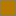
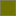
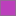
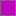
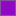
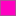
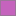
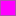

# Parity with Visual Studio 2026

<!-- Generated by scripts/build.mjs from src/palettes/. Do not edit: npm run build rewrites it, and
     npm run check fails when it is stale. -->

Every colour in the theme is a palette role, and every role records where its value came from.
This page lists them all, so it shows at a glance how much of the theme is Visual Studio's own
data and how much is not. What a VS Code theme cannot reproduce at all is in the README's
[known limits](../README.md#known-limits).

**What the sources mean.** Visual Studio's themes are files of named colours, *tokens*, grouped by
category: `Shell.AccentFillDefault` is the purple accent, `Text Editor Language Service
Items.Keyword` the keyword blue. Visual Studio looks each colour up by its name when it draws, and
`scripts/vs-tokens.mjs` reads the same files from a Visual Studio install. In short:

- **token** means Visual Studio's own declared colour, read from its theme files;
- **sampled** means what Visual Studio actually showed on screen, measured from a running window;
- **inferred** means Visual Studio has no equivalent, so a value was chosen to fit.

Declared and shown are not always the same colour. Visual Studio draws some tokens translucent or
dotted (its find highlight token is `#773800`, but on screen it is `#453B32`), and its Light theme
leaves many editor colours out of its files altogether, falling back on defaults built into Visual
Studio. Where the two differ, the theme generally takes what is shown and the note keeps the token
beside it; where it keeps the token instead, the note says why.

| Source | Meaning | Dark | Light |
|---|---|---|---|
| token | a colour token or classification Visual Studio 2026 ships in its theme files | 113 | 69 |
| VS built-in | a Visual Studio colour that is not a theme token: a classification default the Light theme leaves out, image-catalog and glyph colours | 7 | 27 |
| sampled | measured from a running Visual Studio 2026 window | 34 | 52 |
| composite | a translucent Visual Studio token flattened onto the surface under it | 9 | 14 |
| derived | another role's value, or a fraction of its opacity | 4 | 6 |
| inferred | no Visual Studio equivalent; chosen to fit | 6 | 5 |
| **total** | | **173** | **173** |

## Variants

The tinted themes and the Extra Contrast editors are generated from Visual Studio's own tokens for
each theme, by the rules in `src/palettes/derive.mjs`. Each overrides only the roles Visual Studio
changes; everything else is its base's.

| Theme | Base | Roles overridden |
|---|---|---|
| Fili.VSCode2026 Light (Bubblegum) | light | 16 |
| Fili.VSCode2026 Light (Cool Breeze) | light | 17 |
| Fili.VSCode2026 Dark (Cool Slate) | dark | 15 |
| Fili.VSCode2026 Dark (Extra Contrast) | dark | 27 |
| Fili.VSCode2026 Dark (High Contrast) | dark | 103 |
| Fili.VSCode2026 Light (Icy Mint) | light | 17 |
| Fili.VSCode2026 Dark (Juicy Plum) | dark | 15 |
| Fili.VSCode2026 Light (Extra Contrast) | light | 27 |
| Fili.VSCode2026 Light (Mango Paradise) | light | 16 |
| Fili.VSCode2026 Dark (Moonlight Glow) | dark | 15 |
| Fili.VSCode2026 Dark (Mystical Forest) | dark | 15 |
| Fili.VSCode2026 Light (Silky Pink) | light | 16 |
| Fili.VSCode2026 Dark (Spicy Red) | dark | 15 |
| Fili.VSCode2026 Light (Sunny Day) | light | 16 |

## Surfaces

| Role | Dark | Light | Source | Used by |
|---|---|---|---|---|
| `chrome` |  `#1C1C1C` |  `#EEEEEE` | ShellInternal.EnvironmentBackground (frame, title bar, menu bar, toolbar; sampled identical) | `titleBar.activeBackground`, `titleBar.inactiveBackground`, `titleBar.border` +7 more |
| `card` |  `#282828` |  `#F9F9F9` | ShellInternal.EnvironmentTab (document and tool-window cards; sampled identical) | `sideBar.background`, `sideBarTitle.background`, `sideBarTitle.border` +37 more |
| `tabWell` |  `#262626` |  `#F7F7F7` | sampled: tab strip behind inactive document tabs | `editorGroupHeader.tabsBackground`, `editorGroupHeader.connectedTabsBackground`, `tab.inactiveBackground` +3 more |
| `editor` |  `#1E1E1E` |  `#FFFFFF` | **Dark:** Text Editor Text Manager Items.Plain Text background **Light:** VS default Plain Text background (sampled identical) | `editorPane.background`, `editor.background`, `editorStickyScroll.background` +15 more |
| `editorLine` |  `#272727` |  `#F7F7F7` | sampled: current-line highlight | `editor.lineHighlightBackground`, `editor.lineHighlightBorder`, `editorStickyScrollHover.background` +1 more |
| `navbar` |  `#2B2B2B` |  `#FFFFFF` | sampled: editor navigation bar (project / type / member dropdowns) | `breadcrumb.background` |
| `editorFooter` |  `#2E2E2E` |  `#F5F5F5` | sampled: editor bottom bar (zoom, issues, Ln/Ch) | `editorHoverWidget.statusBarBackground` |
| `flyout` |  `#2C2C2C` |  `#F9F9F9` | Shell.SurfaceBackgroundFillDefault (menus, IntelliSense, hovers) | `menu.background`, `listFilterWidget.background`, `editorGroup.dropIntoPromptBackground` +14 more |
| `flyoutHover` |  `#3D3D3D` |  `#EAEAEA` | **Dark:** Environment.CommandBarMenuItemMouseOver **Light:** composite: Shell.SubtleFillSecondary #0000000f over flyout | `menu.selectionBackground`, `editorSuggestWidget.selectedBackground`, `editorActionList.focusBackground` +3 more |
| `flyoutBorder` |  `#454545` |  `#DADADA` | **Dark:** ShellInternal.EnvironmentBorderInactive **Light:** Shell.CardStrokeDefaultSolidAlt | `widget.border`, `menu.border`, `editorGroup.dropIntoPromptBorder` +9 more |
| `shadow` |  `#00000042` |  `#00000024` | Shell.ShadowFlyout | `widget.shadow`, `scrollbar.shadow`, `sideBarStickyScroll.shadow` +5 more |

## Controls and buttons

| Role | Dark | Light | Source | Used by |
|---|---|---|---|---|
| `control` |  `#383838` |  `#FFFFFF` | **Dark:** Environment.DropDownBackground / ComboBoxBackground (sampled on the chat input) **Light:** Shell.ControlFillActiveInput (sampled on the chat input) | `input.background`, `dropdown.background`, `checkbox.background` +19 more |
| `controlHover` |  `#3D3D3D` |  `#F3F3F3` | **Dark:** Environment.ComboBoxMouseOverBackground **Light:** Shell.ControlFillQuaternary #f3f3f3c2, flattened | `toolbar.hoverBackground`, `menubar.selectionBackground`, `commandCenter.activeBackground` +13 more |
| `controlBorder` |  `#454545` |  `#DCDCDC` | **Dark:** ShellInternal.EnvironmentBorderInactive **Light:** sampled 2026-10-04: Solution Explorer search box, bottom stroke (sides #EAEAEA), as Dark takes its bottom stroke | `commandCenter.activeBorder`, `input.border`, `dropdown.border` +14 more |
| `buttonSecondary` |  `#3D3D3D` |  `#FDFDFD` | **Dark:** CommonControls.Button **Light:** composite: Shell.ControlFillDefault #ffffffb2 over card | `checkbox.disabled.background`, `keybindingLabel.background`, `button.secondaryBackground` |
| `buttonSecondaryHover` |  `#4D4D4D` |  `#F0F0F0` | **Dark:** CommonControls.ButtonHover **Light:** composite: Shell.SubtleFillTertiary over buttonSecondary | `button.secondaryHoverBackground` |
| `buttonBorder` |  `#3D3D3D` |  `#ACACAC` | sampled: chat suggestion button outline | `button.secondaryBorder` |

## Borders and dividers

| Role | Dark | Light | Source | Used by |
|---|---|---|---|---|
| `windowBorder` |  `#454545` |  `#ADADAD` | **Dark:** ShellInternal.EnvironmentBorderInactive (card outline; sampled identical) **Light:** ShellInternal.EnvironmentBorderInactive (card outline) | `window.inactiveBorder`, `sideBar.border`, `editorGroup.border` +12 more |
| `divider` |  `#3A3A3A` |  `#E6E6E6` | **Dark:** composite: Shell.DividerStrokeDefault #ffffff15 over card **Light:** composite: Shell.DividerStrokeDefault #00000014 over card | `commandCenter.border`, `commandCenter.inactiveBorder`, `menu.separatorBackground` +36 more |
| `treeIndent` |  `#4D4D4D` |  `#C8C8C8` | inferred: between divider and fgDisabled | `tree.indentGuidesStroke`, `tree.inactiveIndentGuidesStroke` |

## Text and links

| Role | Dark | Light | Source | Used by |
|---|---|---|---|---|
| `fg` |  `#FAFAFA` |  `#1E1E1E` | Environment.ToolWindowText / PanelText | `foreground`, `titleBar.activeForeground`, `menubar.selectionForeground` +83 more |
| `fgSecondary` |  `#D1D1D1` |  `#5F5F5F` | **Dark:** composite: Shell.TextFillSecondary #ffffffc8 over card **Light:** composite: Shell.TextFillSecondary #0000009e over card | `descriptionForeground`, `icon.foreground`, `commandCenter.foreground` +18 more |
| `fgTertiary` |  `#9D9D9D` |  `#8A8A8A` | **Dark:** composite: Shell.TextFillTertiary #ffffff8b over card **Light:** composite: Shell.TextFillTertiary #00000072 over card | `titleBar.inactiveForeground`, `commandCenter.inactiveForeground`, `activityBar.inactiveForeground` +32 more |
| `fgDisabled` |  `#767676` |  `#9F9F9F` | **Dark:** composite: Shell.TextFillDisabled #ffffff5d over card **Light:** composite: Shell.TextFillDisabled #0000005c over card | `disabledForeground`, `tab.unfocusedActiveBorderTop`, `tab.unfocusedActiveModifiedBorder` +8 more |
| `tabTextInactive` |  `#B2B2B2` |  `#717171` | Environment.FileTabInactiveText | `tab.inactiveForeground`, `tab.inactiveModifiedBorder`, `tab.unfocusedInactiveForeground` +2 more |
| `lineNumber` |  `#8A8A8A` |  `#7A7A7A` | Text Editor MEF Items.Line Number | `editorLineNumber.foreground` |
| `lineNumberActive` |  `#E0E0E0` |  `#000000` | Text Editor MEF Items.Selected Line Number | `editorLineNumber.activeForeground`, `editorActiveLineNumber.foreground` |
| `cursor` |  `#DCDCDC` |  `#000000` | **Dark:** Plain Text foreground **Light:** VS default Plain Text foreground | `editorCursor.foreground`, `editorMultiCursor.primary.foreground` |
| `link` |  `#83BEEB` |  `#005FB8` | **Dark:** Environment.PanelHyperlink / InfoBar.Hyperlink **Light:** Shell.HyperlinkFillTertiary | `editorLink.activeForeground`, `extensionIcon.verifiedForeground`, `notificationLink.foreground` +2 more |
| `linkHover` |  `#A8D2F2` |  `#003E92` | **Dark:** inferred: link lightened toward fg **Light:** Shell.HyperlinkFillPrimary | `textLink.activeForeground` |

## Accent

| Role | Dark | Light | Source | Used by |
|---|---|---|---|---|
| `accent` |  `#9184EE` |  `#5649B0` | Shell.AccentFillDefault (sampled on the focused window outline) | `focusBorder`, `sash.hoverBorder`, `progressBar.background` +47 more |
| `windowAccent` |  `#9184EE` |  `#5649B0` | ShellInternal.EnvironmentBorder: focused-window outline and Solution Explorer selection pill (equals the accent here; the tinted themes change it) | `window.activeBorder`, `activityBar.activeBorder`, `activityBar.activeFocusBorder` +7 more |
| `accentFg` |  `#000000` |  `#FFFFFF` | Shell.TextOnAccentFillPrimary | `activityBarBadge.foreground`, `activityErrorBadge.foreground`, `activityWarningBadge.foreground` +10 more |
| `accentText` |  `#A79CF1` |  `#5649B0` | Shell.AccentTextFillTertiary | `list.highlightForeground`, `list.focusHighlightForeground`, `editorSuggestWidget.focusHighlightForeground` +8 more |
| `accentMuted` |  `#353340` |  `#E5E4F0` | **Dark:** composite: Shell.AccentFillSenary #9184ee1f over card **Light:** composite: Shell.AccentFillSenary #5649b01f over card | `sideBar.dropBackground`, `list.dropBackground`, `editorGroup.dropBackground` +11 more |
| `accentStrong` |  `#403582` |  `#5649B0` | **Dark:** CommonControls.ButtonDefault (VS primary button) **Light:** Shell.AccentFillDefault (Fluent primary button fill) | `button.background`, `extensionButton.background`, `extensionButton.prominentBackground` +2 more |
| `accentStrongFg` |  `#FAFAFA` |  `#FFFFFF` | **Dark:** CommonControls.ButtonDefault foreground **Light:** Shell.TextOnAccentFillPrimary | `button.foreground`, `button.separator`, `extensionButton.foreground` +3 more |
| `accentHover` |  `#4B3F96` |  `#665BB7` | **Dark:** inferred: ButtonDefault lightened one step **Light:** composite: Shell.AccentFillSecondary #5649b0e5 over card | `button.hoverBackground`, `extensionButton.hoverBackground`, `extensionButton.prominentHoverBackground` +1 more |

## Selection, find, lists and file icons

| Role | Dark | Light | Source | Used by |
|---|---|---|---|---|
| `selection` |  `#004377` |  `#5CA9E566` | **Dark:** Text Editor MEF Items.Selected Text **Light:** Text Editor MEF Items.Selected Text #5CA9E5 at 40%: VS draws its selection translucent | `selection.background`, `editor.selectionBackground`, `minimap.selectionHighlight` +1 more |
| `selectionInactive` |  `#383838` |  `#E3E3E3` | **Dark:** Text Editor MEF Items.Inactive Selected Text **Light:** composite: Text Editor MEF Items.Inactive Selected Text #D1D1D1 at 60% over editor | `editor.inactiveSelectionBackground`, `editor.foldBackground`, `terminal.inactiveSelectionBackground` |
| `selectionHighlight` |  `#113D6F` |  `#E2E6D6` | **Dark:** sampled 2026-10-04: highlighted references, as drawn (token MarkerFormatDefinition/HighlightedReference #0E4583) **Light:** sampled 2026-10-04: highlighted references, as drawn | `editor.selectionHighlightBackground`, `editor.wordHighlightBackground`, `editor.wordHighlightStrongBackground` +9 more |
| `findMatch` |  `#453B32` |  `#E4D8C2` | **Dark:** sampled 2026-10-04: find matches, as drawn (token MarkerFormatDefinition/FindHighlight #773800); VS marks the current match by selecting it **Light:** sampled 2026-10-04: find matches, as drawn; VS marks the current match by selecting it (Dark draws its #773800 token as #453B32) | `editor.findMatchBackground`, `editorOverviewRuler.findMatchForeground`, `minimap.findMatchHighlight` +3 more |
| `findMatchOther` |  `#453B32` |  `#E4D8C2` | sampled 2026-10-04: the non-current find matches, as drawn | `list.filterMatchBackground`, `editor.findMatchHighlightBackground`, `editor.symbolHighlightBackground` +5 more |
| `bracketMatch` |  `#113D6F` |  `#E2E6D6` | **Dark:** sampled 2026-10-04: matched braces, as drawn; the same fill as references (token brace matching #0E4583) **Light:** sampled 2026-10-04: matched braces, as drawn; the same fill as references, as in Dark | `editorBracketMatch.background` |
| `scopeHighlight` |  `#0F202D` |  `#F2F6FA` | **Dark:** Text Editor MEF Items.MarkerFormatDefinition/ScopeHighlight **Light:** inferred: light counterpart of ScopeHighlight | `editor.findRangeHighlightBackground`, `editor.rangeHighlightBackground`, `editorOverviewRuler.rangeHighlightForeground` |
| `listSelection` |  `#353535` |  `#EAEAEA` | **Dark:** sampled: Solution Explorer selected row; equals Shell.SubtleFillSecondary #ffffff0f over card **Light:** sampled: Solution Explorer selected row; equals Shell.SubtleFillSecondary #0000000f over card | `toolbar.activeBackground`, `list.activeSelectionBackground`, `list.focusBackground` +5 more |
| `listSelectionInactive` |  `#353535` |  `#EAEAEA` | sampled: VS keeps the same fill when Solution Explorer loses focus | `list.inactiveSelectionBackground`, `list.inactiveFocusBackground`, `notebook.selectedCellBackground` |
| `listHover` |  `#313131` |  `#EFEFEF` | **Dark:** composite: Shell.SubtleFillTertiary #ffffff0b over card (Fluent list hover) **Light:** composite: Shell.SubtleFillTertiary #0000000a over card (Fluent list hover) | `list.hoverBackground`, `tree.tableOddRowsBackground`, `keybindingTable.rowsBackground` +5 more |
| `fileFolder` |  `#FFDD96` |  `#B47B00` | sampled: Solution Explorer folder outline | `folder-properties icon`, `folder-web icon`, `folder icon` |
| `fileCsharp` |  `#83F380` |  `#11920D` | sampled: Solution Explorer C# glyph | `csharp icon`, `project icon`, `razor icon` |
| `fileGlyph` |  `#E3E3E3` |  `#202020` | sampled: Solution Explorer monochrome file glyphs | `css icon`, `database icon`, `file icon` +17 more |

## Status colours and editor decorations

| Role | Dark | Light | Source | Used by |
|---|---|---|---|---|
| `error` |  `#FF99A4` |  `#C42B1C` | Shell.SystemFillCritical | `errorForeground`, `activityErrorBadge.background`, `list.errorForeground` +21 more |
| `warning` |  `#FCE100` |  `#9D5D00` | Shell.SystemFillCaution | `activityWarningBadge.background`, `list.warningForeground`, `editorLightBulb.foreground` +13 more |
| `info` |  `#60CDFF` |  `#005FB7` | Shell.SystemFillAttention | `editorLightBulbAutoFix.foreground`, `problemsInfoIcon.foreground`, `editorGutter.modifiedBackground` +24 more |
| `success` |  `#6CCB5F` |  `#0F7B0F` | Shell.SystemFillSuccess | `editorOverviewRuler.currentContentForeground`, `merge.currentHeaderBackground`, `mergeEditor.conflict.handledUnfocused.border` +16 more |
| `errorBg` |  `#442726` |  `#FDE7E9` | Shell.SystemFillCriticalBackground | `editorMarkerNavigationError.headerBackground`, `inputValidation.errorBackground`, `debugExceptionWidget.background` +2 more |
| `warningBg` |  `#433519` |  `#FFF4CE` | **Dark:** Shell.SystemFillCautionBackground / InfoBar.InfoBarBackground **Light:** Shell.SystemFillCautionBackground | `editorMarkerNavigationWarning.headerBackground`, `inputValidation.warningBackground`, `banner.background` |
| `infoBg` |  `#304048` |  `#E0EAF2` | **Dark:** composite: Shell.SystemFillAttention at 15% over card **Light:** composite: Shell.SystemFillAttention at 10% over card | `editorMarkerNavigationInfo.headerBackground`, `inputValidation.infoBackground`, `testing.messagePeekHeaderBackground` +1 more |
| `successBg` |  `#393D1B` |  `#DFF6DD` | Shell.SystemFillSuccessBackground | `merge.currentContentBackground`, `mergeEditor.conflict.input1.background` |
| `squiggleError` |  `#FC3E36` |  `#E51400` | **Dark:** Text Editor MEF Items.syntax error **Light:** TreeView.ValidationSquiggles | `editorError.foreground`, `editorOverviewRuler.errorForeground`, `minimap.errorHighlight` |
| `squiggleWarning` |  `#95DB7D` |  `#008000` | **Dark:** Text Editor MEF Items.compiler warning (VS warnings are green) **Light:** VS default compiler warning (VS warnings are green) | `editorWarning.foreground`, `editorOverviewRuler.warningForeground`, `minimap.warningHighlight` |
| `squiggleInfo` |  `#CA79EC` |  `#800080` | **Dark:** Text Editor MEF Items.other error **Light:** Roslyn Text Editor MEF Items.inline diagnostics - Edit and Continue | `editorInfo.foreground`, `editorOverviewRuler.infoForeground`, `minimap.infoHighlight` |
| `squiggleHint` |  `#A5A5A5` |  `#A5A5A5` | Text Editor MEF Items.hinted suggestion | `editorHint.foreground` |
| `ghostText` |  `#A5A5A5` |  `#A5A5A5` | Text Editor MEF Items.hinted suggestion | `editor.placeholder.foreground`, `editorGhostText.foreground`, `terminal.initialHintForeground` +1 more |
| `inlayHintBg` |  `#3E3E3E` |  `#E6E6FA` | Roslyn Text Editor MEF Items.inline hints background | `editorInlayHint.background`, `editorInlayHint.typeBackground`, `editorInlayHint.parameterBackground` +1 more |
| `inlayHintFg` |  `#A9A8A7` |  `#686868` | Roslyn Text Editor MEF Items.inline hints foreground | `editorInlayHint.foreground`, `editorInlayHint.typeForeground`, `editorInlayHint.parameterForeground` |
| `whitespace` |  `#3B5A60` |  `#95C8D7` | **Dark:** Text Editor MEF Items.Visible Whitespace #144852, lifted: VS draws it bolder than VS Code does **Light:** VS default Visible Whitespace #2B91AF at 50% | `editorWhitespace.foreground` |
| `indentGuide` |  `#3D3D3D` |  `#F0F0F0` | **Dark:** sampled 2026-10-04: block structure guide lines, as drawn dotted (token Block Structure Adornments #424242) **Light:** sampled 2026-10-04: block structure guide lines, as drawn (solid in Light; Dark draws its #424242 token dotted) | `editorIndentGuide.background1`, `editorRuler.foreground`, `editorBracketPairGuide.background1` +11 more |
| `indentGuideActive` |  `#707070` |  `#ADADAD` | **Dark:** Environment.ActiveBorder **Light:** ShellInternal.EnvironmentBorderInactive | `editorIndentGuide.activeBackground1`, `editorIndentGuide.activeBackground`, `editorIndentGuide.activeBackground2` +4 more |
| `snippetField` |  `#4F4F4F` |  `#FFE7A0` | **Dark:** sampled 2026-10-04: an inactive snippet field, as drawn (token Code Snippet Field #5B5B5B) **Light:** sampled 2026-10-04: an inactive snippet field, as drawn (Dark draws its #5B5B5B token as #4F4F4F) | `editor.snippetTabstopHighlightBackground` |
| `unnecessaryOpacity` |  `#000000A0` |  `#000000A0` | alpha only: VS fades unnecessary code to ~60% | `editorUnnecessaryCode.opacity`, `minimap.foregroundOpacity` |

## Status bar

| Role | Dark | Light | Source | Used by |
|---|---|---|---|---|
| `statusBar` |  `#141414` |  `#6C6C6C` | **Dark:** composite: ShellInternal.StatusBarBackgroundFillRest #0000004d over chrome (sampled identical) **Light:** composite: ShellInternal.StatusBarBackgroundFillRest #0000008b over chrome (sampled identical) | `statusBar.background`, `statusBar.border`, `statusBar.noFolderBackground` +2 more |
| `statusBarText` |  `#FFFFFF` |  `#FFFFFF` | ShellInternal.StatusBarTextFillRest | `statusBar.foreground`, `statusBar.debuggingForeground`, `statusBar.noFolderForeground` +11 more |
| `statusBarHover` |  `#313131` |  `#565656` | **Dark:** composite: ShellInternal.StatusBarControlFillSecondary #ffffff20 over statusBar **Light:** composite: ShellInternal.StatusBarControlFillSecondary #00000033 over statusBar | `statusBarItem.activeBackground`, `statusBarItem.hoverBackground`, `statusBarItem.compactHoverBackground` |
| `statusBarDebug` |  `#7A2101` |  `#BC4B09` | ShellInternal.StatusBarBackgroundFillDebugging | `commandCenter.debuggingBackground`, `statusBar.debuggingBackground`, `statusBar.debuggingBorder` |
| `statusBarBuilding` |  `#3F3682` |  `#5649B0` | ShellInternal.StatusBarBackgroundFillBuilding | `statusBarItem.prominentBackground`, `statusBarItem.prominentHoverBackground` |
| `statusBarLoading` |  `#003B6A` |  `#005BA1` | ShellInternal.StatusBarBackgroundFillSolutionLoading | `statusBarItem.remoteBackground`, `statusBarItem.remoteHoverBackground` |
| `statusBarError` |  `#C42B1C` |  `#C42B1C` | ShellInternal.CaptionControlCloseFillPrimary | `statusBarItem.errorBackground`, `statusBarItem.errorHoverBackground`, `debugView.exceptionLabelBackground` |
| `statusBarWarning` |  `#7A5A00` |  `#9D5D00` | **Dark:** inferred: SystemFillCaution darkened to carry white text **Light:** Shell.SystemFillCaution | `statusBarItem.offlineBackground`, `statusBarItem.offlineHoverBackground`, `statusBarItem.warningBackground` +1 more |

## Scroll bars

| Role | Dark | Light | Source | Used by |
|---|---|---|---|---|
| `scrollThumb` |  `#4D4D4D` |  `#C2C3C9` | Environment.ScrollBarThumbBackground | `scrollbarSlider.background`, `minimapSlider.background`, `notebookScrollbarSlider.background` |
| `scrollThumbHover` |  `#707070` |  `#8D8D8D` | **Dark:** Environment.ScrollBarThumbMouseOverBorder **Light:** sampled: VS 2026 overlay scrollbar thumb | `scrollbarSlider.hoverBackground`, `minimapSlider.hoverBackground`, `notebookScrollbarSlider.hoverBackground` |
| `scrollThumbActive` |  `#999999` |  `#5B5B5B` | **Dark:** Environment.ScrollBarThumbPressedBackground (sampled identical) **Light:** Environment.ScrollBarThumbPressedBackground | `scrollbarSlider.activeBackground`, `minimapSlider.activeBackground`, `notebookScrollbarSlider.activeBackground` |

## Debugging

| Role | Dark | Light | Source | Used by |
|---|---|---|---|---|
| `debugCurrent` |  `#EFF28440` |  `#FFEE6280` | **Dark:** Text Editor MEF Items.Current Statement #EFF284 at 25%: VS repaints the text black, VS Code cannot **Light:** VS default Current Statement #FFEE62 at 50% | `editor.stackFrameHighlightBackground` |
| `debugCurrentGlyph` |  `#FFCC00` |  `#D9A400` | **Dark:** inferred: VS 2026 draws a two-tone arrow (dark-amber fill, light outline) over the breakpoint; VS Code's glyph has one colour, so it takes the arrow's yellow **Light:** inferred: VS 2026 draws a two-tone arrow (cream fill, dark outline) over the breakpoint; VS Code's glyph has one colour, so it takes a yellow that reads on a white margin | `debugIcon.breakpointCurrentStackframeForeground` |
| `debugFocused` |  `#73949040` |  `#B9DFB980` | **Dark:** sampled 2026-10-04: Call Return on the selected caller frame, #739490 as drawn (token #7CA5A0), at 25% so the text stays readable **Light:** sampled 2026-10-04: Call Return on the selected caller frame, #B9DFB9 as drawn, at 50% so the text stays readable | `editor.focusedStackFrameHighlightBackground` |
| `breakpoint` |  `#E51400` |  `#E51400` | VS breakpoint glyph red | `debugIcon.breakpointForeground` |
| `breakpointDisabled` |  `#AEAEAE` |  `#A0A0A0` | **Dark:** Text Editor MEF Items.Breakpoint (Disabled) **Light:** inferred: VS 2026 draws a disabled breakpoint as a red hollow circle; VS Code's disabled glyph is a filled dot, which in red would look enabled, so it stays grey | `debugIcon.breakpointDisabledForeground`, `debugIcon.breakpointUnverifiedForeground` |

## Diff

| Role | Dark | Light | Source | Used by |
|---|---|---|---|---|
| `diffAddLine` |  `#15352C` |  `#EBF1DD` | **Dark:** Text Editor MEF Items.deltadiff.add.line (drawn as the token; confirmed 2026-10-07 on a line without the caret) **Light:** sampled 2026-10-07 in the diff view: added line, away from the caret (the 2026-10-04 value #E6EBDA was the caret line, under the current-line highlight) | `diffEditor.insertedLineBackground`, `diffEditorGutter.insertedLineBackground`, `testing.coveredBackground` +2 more |
| `diffAddWord` |  `#265E4D` |  `#D7E3BC` | **Dark:** Text Editor MEF Items.deltadiff.add.word **Light:** sampled 2026-10-04 in the diff view: added word | `diffEditor.insertedTextBackground`, `inlineChatDiff.inserted`, `inlineEdit.modifiedChangedTextBackground` |
| `diffRemoveLine` |  `#2D0000` |  `#FFCCCC` | **Dark:** Text Editor MEF Items.deltadiff.remove.line (drawn as the token; confirmed 2026-10-07 on a line without the caret) **Light:** sampled 2026-10-07 in the diff view: removed line, away from the caret (the 2026-10-04 value #F7CCCC was the caret line, under the current-line highlight) | `diffEditor.removedLineBackground`, `diffEditorGutter.removedLineBackground`, `testing.uncoveredBackground` +2 more |
| `diffRemoveWord` |  `#3C0000` |  `#FF9999` | **Dark:** Text Editor MEF Items.deltadiff.remove.word **Light:** sampled 2026-10-04 in the diff view: removed word | `diffEditor.removedTextBackground`, `testing.uncoveredBranchBackground`, `inlineChatDiff.removed` +1 more |

## Source control

| Role | Dark | Light | Source | Used by |
|---|---|---|---|---|
| `gitAdded` |  `#6CCB5F` |  `#0F7B0F` | Shell.SystemFillSuccess | `editorGutter.addedBackground`, `editorGutter.addedSecondaryBackground`, `editorOverviewRuler.addedForeground` +15 more |
| `gitModified` |  `#D0B132` |  `#9D5D00` | **Dark:** Track Changes before save **Light:** Shell.SystemFillCaution | `gitDecoration.modifiedResourceForeground`, `gitDecoration.stageModifiedResourceForeground`, `chat.editedFileForeground` +1 more |
| `gitDeleted` |  `#FF99A4` |  `#C42B1C` | Shell.SystemFillCritical | `editorGutter.deletedBackground`, `editorGutter.deletedSecondaryBackground`, `editorOverviewRuler.deletedForeground` +15 more |
| `gitIgnored` |  `#767676` |  `#9F9F9F` | fgDisabled | `gitDecoration.ignoredResourceForeground` |
| `gitConflict` |  `#F7A35C` |  `#C85A00` | inferred: orange between caution and critical | `mergeEditor.conflict.unhandledUnfocused.border`, `mergeEditor.conflict.unhandledFocused.border`, `mergeEditor.conflict.unhandled.minimapOverViewRuler` +3 more |
| `gitSubmodule` |  `#83BEEB` |  `#005FB8` | link | `gitDecoration.submoduleResourceForeground` |

## Icon colours

| Role | Dark | Light | Source | Used by |
|---|---|---|---|---|
| `iconPurple` |  `#B180D7` |  `#652D90` | **Dark:** VS image catalog purple (dark) **Light:** VS image catalog purple | `scmGraph.historyItemRemoteRefColor`, `scmGraph.foreground4`, `terminalSymbolIcon.aliasForeground` +8 more |
| `iconOrange` |  `#E8AB53` |  `#C27D1A` | **Dark:** VS image catalog orange (dark) **Light:** VS image catalog orange | `extensionIcon.starForeground`, `extensionIcon.preReleaseForeground`, `scmGraph.historyItemBaseRefColor` +13 more |
| `iconBlue` |  `#75BEFF` |  `#1BA1E2` | **Dark:** VS image catalog blue (dark) **Light:** VS image catalog blue | `scmGraph.foreground1`, `terminalSymbolIcon.optionValueForeground`, `terminalSymbolIcon.argumentForeground` +13 more |
| `iconGreen` |  `#89D185` |  `#388A34` | **Dark:** VS image catalog green (dark) **Light:** VS image catalog green | `scmGraph.foreground2`, `charts.green`, `terminalSymbolIcon.pullRequestForeground` |
| `iconRed` |  `#F48771` |  `#A1260D` | **Dark:** VS image catalog red (dark) **Light:** VS image catalog red | `extensionIcon.sponsorForeground`, `scmGraph.foreground5`, `charts.red` |
| `iconGray` |  `#C5C5C5` |  `#424242` | **Dark:** VS image catalog neutral (dark) **Light:** VS image catalog neutral | `symbolIcon.arrayForeground`, `symbolIcon.colorForeground`, `symbolIcon.constantForeground` +18 more |

## Terminal

| Role | Dark | Light | Source | Used by |
|---|---|---|---|---|
| `ansiBlack` |  `#000000` |  `#000000` | sampled 2026-10-04: VS 2026 terminal, ANSI colour 0 | `terminal.ansiBlack` |
| `ansiRed` |  `#D03E3E` |  `#CD3131` | sampled 2026-10-04: VS 2026 terminal, ANSI colour 1 | `terminal.ansiRed` |
| `ansiGreen` |  `#0DBC79` |  `#008000` | sampled 2026-10-04: VS 2026 terminal, ANSI colour 2 | `terminal.ansiGreen` |
| `ansiYellow` |  `#E5E510` |  `#707300` | sampled 2026-10-04: VS 2026 terminal, ANSI colour 3 | `terminal.ansiYellow` |
| `ansiBlue` |  `#2472C8` |  `#0451A5` | sampled 2026-10-04: VS 2026 terminal, ANSI colour 4 | `terminal.ansiBlue` |
| `ansiMagenta` |  `#BC3FBC` |  `#BC05BC` | sampled 2026-10-04: VS 2026 terminal, ANSI colour 5 | `terminal.ansiMagenta` |
| `ansiCyan` |  `#11A8CD` |  `#007997` | sampled 2026-10-04: VS 2026 terminal, ANSI colour 6 | `terminal.ansiCyan` |
| `ansiWhite` |  `#E5E5E5` |  `#555555` | sampled 2026-10-04: VS 2026 terminal, ANSI colour 7 | `terminal.ansiWhite` |
| `ansiBrightBlack` |  `#838383` |  `#666666` | sampled 2026-10-04: VS 2026 terminal, ANSI colour 8 | `terminal.ansiBrightBlack` |
| `ansiBrightRed` |  `#F14C4C` |  `#CD3131` | sampled 2026-10-04: VS 2026 terminal, ANSI colour 9 | `terminal.ansiBrightRed` |
| `ansiBrightGreen` |  `#23D18B` |  `#008000` | sampled 2026-10-04: VS 2026 terminal, ANSI colour 10 | `terminal.ansiBrightGreen` |
| `ansiBrightYellow` |  `#F5F543` |  `#707300` | sampled 2026-10-04: VS 2026 terminal, ANSI colour 11 | `terminal.ansiBrightYellow` |
| `ansiBrightBlue` |  `#3B8EEA` |  `#0451A5` | sampled 2026-10-04: VS 2026 terminal, ANSI colour 12 | `terminal.ansiBrightBlue` |
| `ansiBrightMagenta` |  `#D670D6` |  `#BC05BC` | sampled 2026-10-04: VS 2026 terminal, ANSI colour 13 | `terminal.ansiBrightMagenta` |
| `ansiBrightCyan` |  `#29B8DB` |  `#007997` | sampled 2026-10-04: VS 2026 terminal, ANSI colour 14 | `terminal.ansiBrightCyan` |
| `ansiBrightWhite` |  `#E5E5E5` |  `#555555` | sampled 2026-10-04: VS 2026 terminal, ANSI colour 15 | `terminal.ansiBrightWhite` |

## Brace pairs

| Role | Dark | Light | Source | Used by |
|---|---|---|---|---|
| `braceLevel1` |  `#FFD700` |  `#0431FA` | Text Editor MEF Items.brace pair level one | `editorBracketHighlight.foreground1`, `editorBracketHighlight.foreground4`, `editorBracketPairGuide.activeBackground1` +1 more |
| `braceLevel2` |  `#DA70D6` |  `#319331` | Text Editor MEF Items.brace pair level two | `editorBracketHighlight.foreground2`, `editorBracketHighlight.foreground5`, `editorBracketPairGuide.activeBackground2` +1 more |
| `braceLevel3` |  `#179FFF` |  `#7B3814` | Text Editor MEF Items.brace pair level three | `editorBracketHighlight.foreground3`, `editorBracketHighlight.foreground6`, `editorBracketPairGuide.activeBackground3` +1 more |

## Syntax: code

| Role | Dark | Light | Source | Used by |
|---|---|---|---|---|
| `synText` |  `#DCDCDC` |  `#000000` | **Dark:** Plain Text **Light:** VS default Plain Text | `editor.foreground`, `editor.selectionForeground`, `editor.findMatchForeground` +6 more |
| `synIdentifier` |  `#DCDCDC` |  `#000000` | **Dark:** Identifier: VS leaves fields, properties, events, constants, enum members and namespaces plain **Light:** VS default Identifier: fields, properties, events, constants, enum members and namespaces stay plain | `Plain text`, `Namespace stays plain`, `namespace` +6 more |
| `synPunctuation` |  `#DCDCDC` |  `#000000` | Roslyn.punctuation | `Punctuation`, `Interpolation punctuation`, `punctuation` |
| `synKeyword` |  `#569CD6` |  `#0000FF` | **Dark:** Keyword **Light:** VS default Keyword | `debugTokenExpression.boolean`, `Keyword`, `Keyword that TextMate files under control but VS does not` +12 more |
| `synControl` |  `#D8A0DF` |  `#8F08C4` | Roslyn.keyword - control | `Control keyword`, `controlKeyword` |
| `synOperator` |  `#B4B4B4` |  `#000000` | **Dark:** Operator **Light:** VS default Operator | `Operator`, `operator` |
| `synString` |  `#D69D85` |  `#A31515` | **Dark:** String **Light:** VS default String | `textPreformat.foreground`, `debugTokenExpression.string`, `String` +8 more |
| `synStringVerbatim` |  `#D69D85` |  `#800000` | Roslyn.string - verbatim | `stringVerbatim` |
| `synStringEscape` |  `#FFD68F` |  `#B776FB` | string - escape character | `Escape sequence`, `stringEscapeCharacter` |
| `synNumber` |  `#B5CEA8` |  `#000000` | **Dark:** Number **Light:** VS default Number | `debugTokenExpression.number`, `Number`, `number` +1 more |
| `synComment` |  `#57A64A` |  `#008000` | **Dark:** Comment **Light:** VS default Comment | `Comment`, `PowerShell: VS draws type literals ([string]) in its comment green, in both themes (sampled)`, `JS/TS: JSDoc text is plain comment green, tags keywords, parameter names variables, types plain` +6 more |
| `synDocText` |  `#608B4E` |  `#008000` | Roslyn.xml doc comment - text | `XML doc comment text`, `xmlDocCommentText`, `xmlDocCommentComment` +1 more |
| `synDocTag` |  `#608B4E` |  `#808080` | Roslyn.xml doc comment - delimiter | `XML doc comment delimiters`, `JSDoc / other doc tags`, `xmlDocCommentDelimiter` +2 more |
| `synDocName` |  `#608B4E` |  `#808080` | Roslyn.xml doc comment - name | `XML doc comment tag names`, `xmlDocCommentName` |
| `synDocAttribute` |  `#C8C8C8` |  `#808080` | Roslyn.xml doc comment - attribute name / value | `XML doc comment attributes`, `xmlDocCommentAttributeName`, `xmlDocCommentAttributeQuotes` +1 more |
| `synPreprocessor` |  `#9B9B9B` |  `#808080` | Preprocessor Keyword | `Preprocessor`, `macro`, `preprocessorKeyword` |
| `synPreprocessorText` |  `#DCDCDC` |  `#000000` | Roslyn.preprocessor text | `Preprocessor symbol`, `preprocessorText` |
| `synExcluded` |  `#9B9B9B` |  `#808080` | **Dark:** Excluded Code **Light:** VS default Excluded Code | `excludedCode` |
| `synType` |  `#4EC9B0` |  `#2B91AF` | Roslyn.class name / delegate name / module name | `debugTokenExpression.type`, `Class, delegate, record, attribute`, `JS/TS: the class after new is a type in VS (the grammar scopes it as a function call)` +19 more |
| `synStruct` |  `#86C691` |  `#2B91AF` | Roslyn.struct name | `Struct`, `struct`, `recordStruct` |
| `synInterface` |  `#B8D7A3` |  `#2B91AF` | Roslyn.interface name / enum name | `Interface, enum`, `interface`, `enum` |
| `synTypeParameter` |  `#B8D7A3` |  `#2B91AF` | Roslyn.type parameter name | `Type parameter`, `typeParameter` |
| `synMethod` |  `#DCDCAA` |  `#74531F` | Roslyn.method name / extension method name / operator - overloaded | `Method, function`, `method`, `function` +2 more |
| `synVariable` |  `#9CDCFE` |  `#1F377F` | Roslyn.local name / parameter name | `debugTokenExpression.name`, `Local, parameter`, `JS/TS: VS colours every identifier that is not a type or function as a variable — properties, enum members and constants too, unlike C#` +12 more |
| `synRegexClass` |  `#2EABFE` |  `#0073FF` | Roslyn.regex - character class | `regexCharacterClass` |
| `synRegexAnchor` |  `#F979AE` |  `#FF00C1` | Roslyn.regex - anchor / quantifier | `regexAnchor`, `regexQuantifier` |
| `synRegexGroup` |  `#05C3BA` |  `#05C3BA` | Roslyn.regex - grouping / alternation | `regexGrouping`, `regexAlternation` |
| `synRegexEscape` |  `#FFD68F` |  `#9E5B71` | Roslyn.regex - other escape | `regexOtherEscape` |
| `synXmlText` |  `#C8C8C8` |  `#000000` | **Dark:** XML Text **Light:** sampled 2026-10-08: VS default XML Text | `XML text between tags (also XAML and MSBuild files, which VS draws as XML)` |
| `synXmlQuote` |  `#808080` |  `#000000` | **Dark:** XML Attribute Quotes **Light:** sampled 2026-10-08: VS default XML Attribute Quotes, black while the value is blue | `XML attribute quotes (VS colours them apart from the value)` |
| `synXmlCData` |  `#E9D585` |  `#808080` | **Dark:** XML CData Section **Light:** sampled 2026-10-08: VS default XML CData Section | `XML CDATA content` |
| `synInvalid` |  `#FC3E36` |  `#E51400` | **Dark:** syntax error **Light:** TreeView.ValidationSquiggles | `editorBracketHighlight.unexpectedBracket.foreground`, `Invalid`, `Deprecated` |

## Syntax: web and data languages

| Role | Dark | Light | Source | Used by |
|---|---|---|---|---|
| `synMarkupTag` |  `#569CD6` |  `#A31515` | **Dark:** XML Name / HTML Element Name **Light:** VS default XML Name | `Markup tag`, `XML DOCTYPE keywords take the element colour, the names in them the attribute colour`, `markupElement` |
| `synMarkupAttribute` |  `#92CAF4` |  `#FF0000` | **Dark:** XML Attribute **Light:** VS default XML Attribute | `Markup attribute`, `XML entity reference (attribute colour in VS, whole &name;)`, `XML DOCTYPE names` |
| `synHtmlAttribute` |  `#9CDCFE` |  `#FF0000` | **Dark:** Text Editor MEF Items.HTML Attribute Name (sampled 2026-10-03 in a Razor file) **Light:** sampled 2026-10-03: VS default HTML Attribute Name, the same as XML | `HTML attribute (VS colours it apart from XML)`, `markupAttribute` |
| `synMarkupAttributeValue` |  `#C8C8C8` |  `#0000FF` | **Dark:** XML Attribute Value **Light:** VS default XML Attribute Value | `Markup attribute value`, `markupAttributeValue`, `markupAttributeQuote` |
| `synMarkupDelimiter` |  `#808080` |  `#0000FF` | **Dark:** XML Delimiter / HTML Tag Delimiter **Light:** VS default XML Delimiter | `Markup delimiter`, `XML processing instruction`, `XML: = inside a tag is a delimiter in VS (the grammar gives it no scope of its own)` +2 more |
| `synMarkupEntity` |  `#00A0A0` |  `#FF0000` | **Dark:** HTML Entity **Light:** VS default HTML Entity | `Markup entity` |
| `synCssSelector` |  `#D7BA7D` |  `#800000` | **Dark:** VS CSS Selector **Light:** VS default CSS Selector | `CSS selector` |
| `synCssProperty` |  `#9CDCFE` |  `#FF0000` | **Dark:** VS CSS Property Name **Light:** VS default CSS Property Name | `CSS property` |
| `synCssValue` |  `#C8C8C8` |  `#0000FF` | **Dark:** VS CSS Property Value **Light:** VS default CSS Property Value | `CSS value` |
| `synJsonKey` |  `#D7BA7D` |  `#2E75B6` | **Dark:** WebEditor.JSON Property Name (sampled 2026-10-03: JSON keys are gold) **Light:** VS default JSON Property Name (sampled 2026-10-03) | `JSON / YAML key`, `jsonPropertyName` |
| `synCssAtRule` |  `#569CD6` |  `#800080` | **Dark:** Text Editor MEF Items.CSS Keyword (sampled 2026-10-03 on @mixin / @include) **Light:** sampled 2026-10-03: VS default for @mixin / @include | `SCSS at-rule` |
| `synCssVariable` |  `#C563BD` |  `#800080` | **Dark:** WebExtensionColorsCategory.ScssVariable* / LessCssVariable* **Light:** sampled 2026-10-03: VS default SCSS / Less variable | `SCSS / Less variable` |
| `synCssMixin` |  `#7DBAD7` |  `#800000` | **Dark:** WebExtensionColorsCategory.ScssMixin* / LessCssMixin* **Light:** sampled 2026-10-03: VS default SCSS / Less mixin | `SCSS mixin` |
| `synRazorDirective` |  `#A699E6` |  `#000000` | **Dark:** WebEditor.RazorTransition / RazorDirective **Light:** sampled 2026-10-03: VS default Razor transition / directive (drawn on a #FFFFC2 server-code block) | `Razor transition and directive`, `razorTransition`, `razorDirective` +1 more |
| `synRazorDirectiveAttribute` |  `#A699E6` |  `#800080` | **Dark:** WebEditor.RazorDirectiveAttribute **Light:** sampled 2026-10-03: VS default Razor directive attribute | `Razor directive attribute`, `razorDirectiveAttribute` |
| `synRazorComponent` |  `#009696` |  `#800080` | **Dark:** WebEditor.RazorComponentElement / RazorComponentAttribute / RazorTagHelper* **Light:** sampled 2026-10-03: VS default Razor component element / attribute | `Razor component and tag helper`, `razorComponentElement`, `razorComponentAttribute` +2 more |
| `synSqlFunction` |  `#C975D5` |  `#FF00FF` | **Dark:** Text Editor Language Service Items.SQL System Function **Light:** sampled 2026-10-03: VS default SQL System Function | `SQL system function` |
| `synSqlString` |  `#CB4141` |  `#FF0000` | **Dark:** Text Editor Language Service Items.SQL String **Light:** sampled 2026-10-03: VS default SQL String | `SQL string` |
| `synHeading` |  `#4EC9B0` |  `#2B91AF` | sampled 2026-10-04: Markdown headings take the class-name colour | `Markdown heading` |
